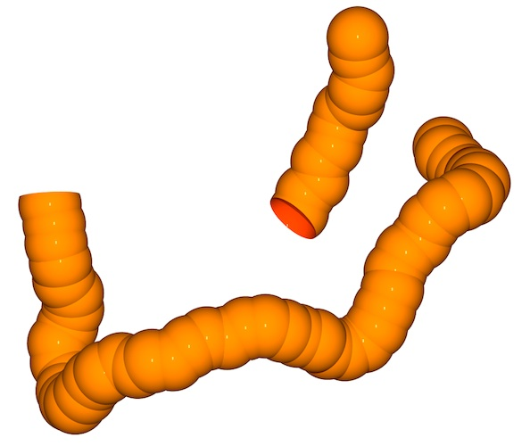
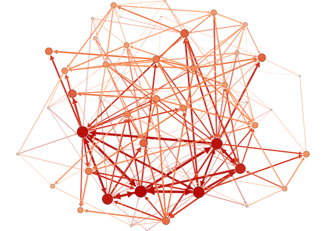
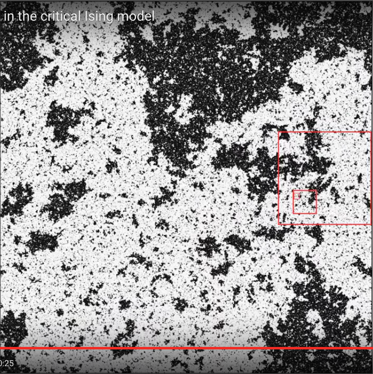
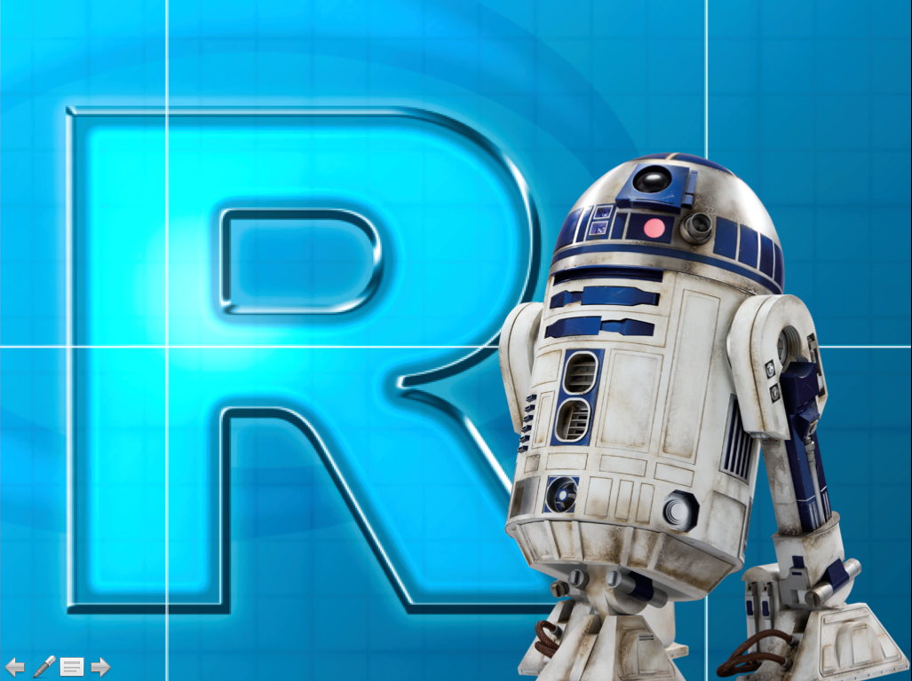
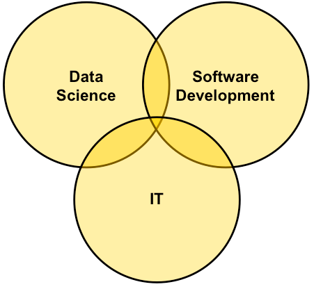
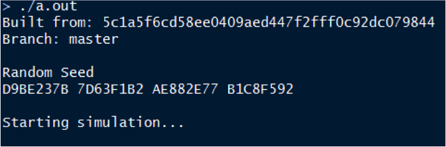
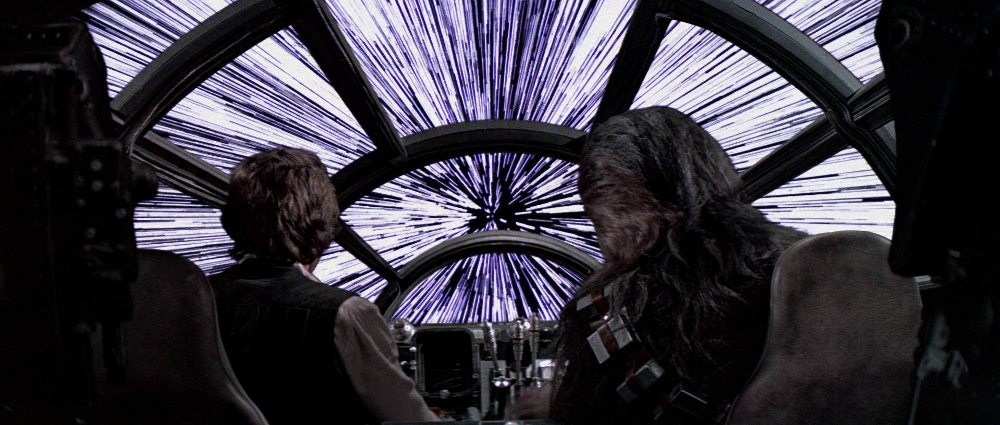
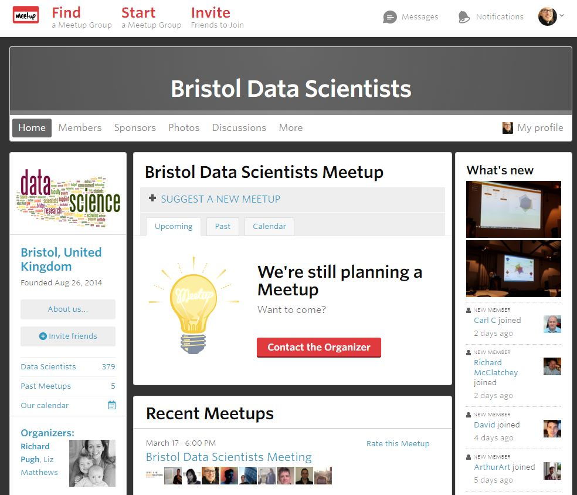

```{r setup, include=FALSE}
knitr::opts_chunk$set(echo = TRUE)
```

# Outline

> 1. What I used to do
> 2. What I do now
> 3. What I would do differently
> 4. How to make the move


# What I used to do { .cover }


# The CV

<center>

<p style="line-height: 110%; margin-bottom: 0;">
1982: Middlesbrough<br>
&darr;<br>
2000: Oxford University (MPhys) <br>
&darr; <br>
2004: University of Nottingham (PhD) <br>
&darr; <br>
2008: University of Bath (Postdoc) <br>
&darr; <br>
2011: Universiteit Utrecht, NL (Postdoc)<br>
&darr;<br>
2012: University of Bath (Postdoc)<br>
&darr;<br>
2014: Mango (Data Scientist)<br>
</p>

# I used to be a pretty big deal around here...

<table width="100%">
<tr><td width="50%">

</td><td width="50%">

</td>
</tr>
</table>
<a href="http://www.dougashton.net">www.dougashton.net</a>

# I used to be a pretty big deal around here...

<table width="100%">
<tr><td width="50%">

</td><td width="50%">

<a href="https://www.youtube.com/playlist?list=PLEiHoEYBhJ0C64aDoOJwpVM41F7RX28ZR">https://www.youtube.com/playlist?list=PLEiHoEYBhJ0C64aDoOJwpVM41F7RX28ZR</a>
</td>
</tr>
</table>

# What I do now {.cover}



# What is data science?

# What is data science?

Mostly branding.

<table width="100%"><tr><td width="50%">
### Academic roots
* Statistics
* Computer Science
</td><td width="50%">

### Applied side
* Data wrangling
* Techy
</td></tr></table>

\[ \sim \mathrm{Physicist} \]

# What is a data scientist?

```{r, message=FALSE, warning=FALSE, echo = FALSE}

labs <- c("Communicator", "Data Wangler", "Programmer",
          "Technologist",  "Modeller", "Visualizer")

scores <- list(
  "Rich" = c(9, 7, 4, 5, 3, 7),
  "Andy" = c(7, 6, 6, 2, 6, 9),
  "Aimee" = c(6, 5, 8, 4, 7, 6)
)

radarchart::chartJSRadar(scores = scores, labs = labs, maxScale = 10)
```

# Physicists who went to data science

*  <a href="https://uk.linkedin.com/in/elainebettaney">Elaine Bettany</a> (Bath to Expedia) 
*   <a href="https://be.linkedin.com/in/patvarilly">Patrick Varilly</a> (Cambridge to Data Minded [Consultancy])
*  <a href="https://www.linkedin.com/in/yaelelmatad">Yael Elmatad</a> (Berkeley to Tapad) 
*  <a href="https://www.linkedin.com/in/aaronkeys">Aaron Keys</a> (Michigan to Airbnb) 


# About Mango Data Science

<div class="double">
<p class="double-flow">
* Analytic Consulting
* Analytic Infrastructure
* Application Development
* Training
* Strategy
</p><p class="double-flow">

</p>
</div>

# What sort of problems

Three examples

* Exploring
* Understanding (Modelling)
* Predicting

# Example 1. Exploring

* Finding patterns in data
* Visualisation
* Building a hypothesis
* Cleaning. Lots of cleaning.

# Example 1. Exploring

```{r, echo=FALSE}
set.seed(11)
knitr::kable(iris[sample(1:nrow(iris),7), ], format="markdown")
```

# Example 1. Exploring

```{r}
kc <- kmeans(iris[,-5], 3)

plot(iris[c("Sepal.Length", "Sepal.Width")], pch=16, col=kc$cluster)
points(kc$centers[,c("Sepal.Length", "Sepal.Width")], col=1:3, pch=8, cex=2)
```

# Example 2. Understanding


# Example 3. Predicting

# Tech


# What I would do differently {.cover}


# What I would do differently

* More R/Python (<a href="https://github.com/dougmet/unsumnet/">unsumnet</a>)
* Version control (GitHub, GitLab)
* Reproducible research
* Project management (Agile, JIRA etc)

# Reproducible Research

In your documents: knitr demo

In your C code


In your environments: <a href="http://www.londonr.org/presentations/2015/11/LondonR_-_Reproducible_Environments_-_Doug_Ashton_-_20151130.pdf">http://www.londonr.org/#presentations</a>

# How to make the move {.cover}


# Get experience

* <a href="https://www.coursera.org/specializations/jhu-data-science"> (jhu-data-science)</a>
* <a href="https://www.kaggle.com/"></a>
* Hackathons
    * <a href="http://www.bathhacked.org/">Bath Hacked (bathhacked.org)</a>
    * <a href="http://www.datakind.org/chapters/datakind-uk"> (datakind.org)

# GitHub

# Meet some people 

<center>
[http://www.meetup.com/Bristol-Data-Scientists/](http://www.meetup.com/Bristol-Data-Scientists/)

</center>


